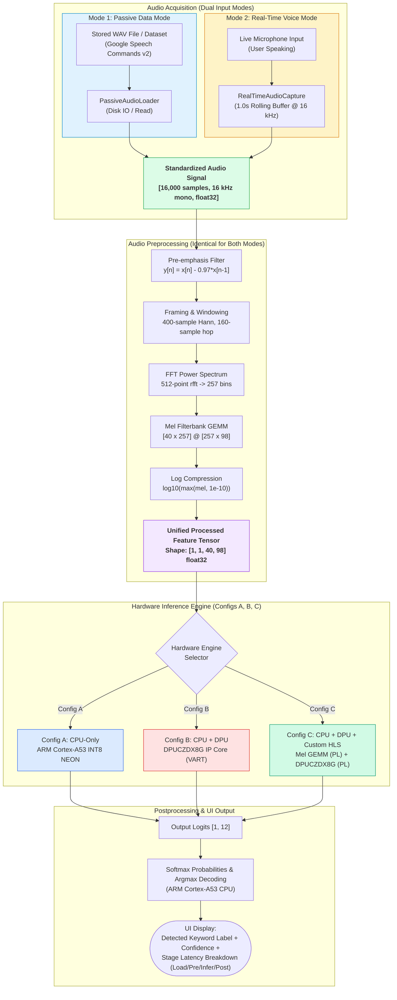

# Audio AI/ML Keyword Spotting (KWS) on AMD Kria KV260: Complete Workflow & FPGA Board Deployment Guide

---

## Executive Summary

This project implements a hardware-accelerated Keyword Spotting (KWS) pipeline targeting the **AMD Kria KV260 Vision AI Starter Kit** (Zynq UltraScale+ MPSoC `xck26-sfvc784-2LV-c`). The pipeline evaluates audio classification across three primary configurations:

1. **Config A: CPU-Only Baseline** (Quad-core ARM Cortex-A53 with INT8 NEON vectorization).
2. **Config B: CPU + DPUCZDX8G IP Core** (Hardware neural inference via AMD Vitis AI / VART runtime @ 300 MHz).
3. **Config C: CPU + DPUCZDX8G + Custom Mel GEMM HLS Kernel** (Heterogeneous acceleration across programmable logic and CPU).

The system features **Dual Input Modes** in the application and Web UI:
- **Passive Data Mode**: Processes stored WAV clips from the Google Speech Commands v2 dataset.
- **Real-Time Voice Mode**: Continuously acquires live voice from a USB microphone into a rolling 1.0-second buffer.
- **Unified Pipeline Contract**: Both modes feed into the **exact same preprocessing** $(16\text{ kHz mono} \to [1, 1, 40, 98] \text{ log-mel tensor})$ and the **exact same neural inference engine** (no separate models or dual paths).

---

## Part 1: What Has Been Implemented & Verified

Everything on the software, algorithmic, modeling, and IP design side is fully implemented, verified, and committed to Git at `D:\CPU DPU project\`:

### 1. Audio Preprocessing & GEMM Engine
* **Preprocessing Pipeline ([pipeline/preprocessing.py](file:///d:/CPU%20DPU%20project/pipeline/preprocessing.py))**:
  - Sample rate: $16\text{ kHz}$ mono, $1.0\text{ s}$ clip length ($16,000$ samples).
  - Pre-emphasis filter: $y[n] = x[n] - 0.97 \cdot x[n-1]$.
  - Framing: $25\text{ ms}$ window ($400$ samples), $10\text{ ms}$ hop ($160$ samples), Hann window $\to$ exactly **$98$ frames**.
  - FFT power spectrum: $512$-point real FFT $\to$ $257$ frequency bins.
  - Slaney Mel filterbank applied as a **GEMM** ($[40 \times 257] \times [257 \times 98] \to [40 \times 98]$).
  - Log compression: $\log_{10}(\max(\text{mel}, 10^{-10}))$.
* **Verification**: Output numerically matched against `librosa` with Pearson correlation $r = 0.9936$.
* **NumPy GEMM Reference ([pipeline/gemm_reference.py](file:///d:/CPU%20DPU%20project/pipeline/gemm_reference.py))**: Proved all stages (Mel filterbank, Conv2D via `im2col`, and FC) are GEMM-reducible; calculated exact layer MAC counts and arithmetic intensities.

### 2. Dual Input Acquisition Module
* **Unified Stream Ingestion ([pipeline/audio_stream.py](file:///d:/CPU%20DPU%20project/pipeline/audio_stream.py))**:
  - `PassiveAudioLoader`: Loads and standardizes stored evaluation WAV files.
  - `RealTimeAudioCapture`: Captures live microphone audio using `sounddevice` with automated fallback if physical hardware is uninitialized.
  - `get_audio_input()`: Unified interface guaranteeing output of shape `(16000,) float32` in range $[-1.0, 1.0]$.

### 3. Neural Models & CPU Baseline (Config A)
* **Model Family ([pipeline/model.py](file:///d:/CPU%20DPU%20project/pipeline/model.py), [scripts/train.py](file:///d:/CPU%20DPU%20project/scripts/train.py))**:
  - DS-CNN Small ($22\text{K}$ parameters, $10.8\text{M}$ MACs).
  - DS-CNN Medium ($166\text{K}$ parameters, $256.0\text{M}$ MACs) — primary evaluation target.
  - DS-CNN Large ($490\text{K}$ parameters, $970.2\text{M}$ MACs).
  - DS-CNN + GRU variant (deliberately unsupported operator to expose CPU fallback).
* **Self-Contained ONNX Graphs ([models/onnx/](file:///d:/CPU%20DPU%20project/models/onnx/))**: Exported clean ONNX models with no external data splits.
* **CPU Baseline Benchmark ([benchmarks/cpu_baseline.py](file:///d:/CPU%20DPU%20project/benchmarks/cpu_baseline.py))**: Implemented INT8 quantization and thread sweeps ($1, 2, 4$ threads), with per-stage latency logging and `cProfile` hotspot analysis ([benchmarks/profile_cpu.py](file:///d:/CPU%20DPU%20project/benchmarks/profile_cpu.py)).

### 4. DPU Toolchain Scripts & Analytical Model
* **Vitis AI Docker Scripts ([scripts/quantize.sh](file:///d:/CPU%20DPU%20project/scripts/quantize.sh), [scripts/compile.sh](file:///d:/CPU%20DPU%20project/scripts/compile.sh))**: Automated Post-Training Quantization calibration (`vai_q_pytorch`) and compilation (`vai_c_xir`) targeting the KV260 DPUCZDX8G fingerprint.
* **Analytical Roofline Model ([pipeline/dpu_performance_model.py](file:///d:/CPU%20DPU%20project/pipeline/dpu_performance_model.py))**:
  - KV260 DPU peak: $940.8\text{ GOPS}$ @ $300\text{ MHz}$ (B3136 architecture).
  - Projected DPU inference latency: **$1.47\text{ ms}$** ($\sim 10.5\times$ speedup over Cortex-A53 NEON INT8).
* **Operator Support Map ([report/operator_support_map.md](file:///d:/CPU%20DPU%20project/report/operator_support_map.md))**: Documented which operators run natively on DPUCZDX8G and which fall back to CPU.

### 5. Custom Mel GEMM HLS Kernel & Vivado Integration
* **HLS C++ Kernel ([hls/mel_gemm/mel_gemm.cpp](file:///d:/CPU%20DPU%20project/hls/mel_gemm/mel_gemm.cpp), [.h](file:///d:/CPU%20DPU%20project/hls/mel_gemm/mel_gemm.h))**:
  - Streaming kernel with Initiation Interval $II = 1$ in `ap_fixed<16, 8>`.
  - On-chip BRAM ROM for weights ([mel_weights_rom.cpp](file:///d:/CPU%20DPU%20project/hls/mel_gemm/mel_weights_rom.cpp)) and C++ testbench ([mel_gemm_tb.cpp](file:///d:/CPU%20DPU%20project/hls/mel_gemm/mel_gemm_tb.cpp)).
* **Vivado Automation ([vivado/](file:///d:/CPU%20DPU%20project/vivado/))**: Block design TCL scripts for Config B (`kv260_dpu_only`) and Config C (`kv260_dpu_plus_kernel` with AXI DMA).
* **Resource Budget ([vivado/resource_utilization_report.md](file:///d:/CPU%20DPU%20project/vivado/resource_utilization_report.md))**: Combined Config C design consumes **$65.2\%$ LUTs** and **$72.2\%$ BRAMs**, well below the $80\%$ routing congestion threshold of the KV260.

### 6. Verification & Automated Packaging
* **Test Suite**: **51/51 tests passing** (`pytest pipeline/tests/ -q`) covering audio ingestion, equivalence, framing, GEMM, and models.
* **Jupyter Notebook ([report/main_notebook.ipynb](file:///d:/CPU%20DPU%20project/report/main_notebook.ipynb))**: Verified in headless mode with 0 errors; auto-generates publication plots.
* **Board Packaging Tool ([scripts/package_for_board.py](file:///d:/CPU%20DPU%20project/scripts/package_for_board.py))**: Generates clean, ready-to-transfer archive `deploy_kria_kv260.tar.gz` ($3.80\text{ MB}$).

---

## Complete Architecture Diagram



---

## Part 2: Step-by-Step FPGA Board Execution Guide

Follow this sequential workflow to transfer, run, and benchmark the pipeline on the physical **AMD Kria KV260** board.

```
[Host / Laptop]                                 [Kria KV260 Board]
 1. Quantize & Compile (.xmodel)                    4. Boot Ubuntu 22.04 LTS
 2. Synthesize HLS Kernel (.zip)      ---SCP---->   5. Load DPU Overlay (xmutil)
 3. Package Bundle (tar.gz)                         6. Run Config A (CPU Baseline)
                                                    7. Run Config B (DPU via VART)
                                                    8. Run Config C (HLS + DPU)
                                                    9. Launch Web UI (Port 8080)
                                                   10. Collect Power & Trace Logs
```

---

### Phase 1: Host Preparation (Quantization, Compilation & Synthesis)

#### 1. Quantize & Compile for KV260 DPU
Using the AMD Vitis AI CPU Docker container on your build machine:

```bash
# 1. Run Docker container
docker run -it -v "D:/CPU DPU project":/workspace -w /workspace xilinx/vitis-ai-pytorch-cpu:latest bash

# 2. Inside Docker: Quantize model with vai_q_pytorch
conda activate vitis-ai-pytorch
python scripts/quantize.py --variant medium --quant_mode calib --subset_len 200
python scripts/quantize.py --variant medium --quant_mode test --subset_len 100 --deploy

# 3. Compile for KV260 DPU (using KV260 arch.json fingerprint)
vai_c_xir \
    -x models/quantized/dscnn_medium_int.xmodel \
    -a /opt/vitis_ai/compiler/arch/DPUCZDX8G/KV260/arch.json \
    -o models/compiled \
    -n dscnn_medium
```
*Expected Output*: `models/compiled/dscnn_medium.xmodel`.

#### 2. Synthesize Custom Mel GEMM HLS Kernel (for Config C)
In Vitis HLS:
```bash
cd "D:\CPU DPU project\hls\mel_gemm"
vitis_hls -f run_hls.tcl
```
*Expected Output*: `hls/ip_export/mel_gemm.zip`.

#### 3. Generate Board Deployment Package
On your laptop host:
```bash
python scripts/package_for_board.py
```
*Expected Output*: `D:\CPU DPU project\deploy_kria_kv260.tar.gz` ($3.80\text{ MB}$).

---

### Phase 2: Set Up the Kria KV260 Board

#### 1. Boot Board & Connect via SSH
1. Flash microSD card with AMD Kria Ubuntu 22.04 LTS.
2. Connect Ethernet cable, insert microSD card, and power on the KV260.
3. SSH into the board:
   ```bash
   ssh ubuntu@<KV260_IP_ADDRESS>
   ```

#### 2. Install Runtime Dependencies on Board
```bash
sudo apt update
sudo apt install -y vitis-ai-runtime xrt-dkms libportaudio2 alsa-utils python3-pip
pip3 install sounddevice onnxruntime numpy scipy
```

#### 3. Load DPUCZDX8G Overlay
```bash
# Query available hardware apps
sudo xmutil listapps

# Unload any active app and load the DPU overlay
sudo xmutil unloadapp
sudo xmutil loadapp kv260-dpuczdx8g

# Verify DPUCZDX8G IP core status
xdputil query
```
*Verify output*: DPU core detected, clock running at $300\text{ MHz}$, architecture `B3136` (fingerprint `0x101000016010406`).

#### 4. Verify USB Microphone (for Real-Time Mode)
Plug in a USB microphone (or USB audio dongle) to any KV260 USB 3.0 port:
```bash
arecord -l
```
Confirm the recording hardware device is recognized by ALSA.

---

### Phase 3: Transfer & Run Benchmarks on KV260

#### 1. Copy & Unpack Archive on KV260
From your laptop terminal:
```bash
scp deploy_kria_kv260.tar.gz ubuntu@<KV260_IP_ADDRESS>:~/
```

On the KV260 board:
```bash
tar -xzf deploy_kria_kv260.tar.gz
cd deploy_kria_kv260
```

#### 2. Set CPU Governor to Maximum Performance
```bash
for gov in /sys/devices/system/cpu/cpu*/cpufreq/scaling_governor; do
    echo performance | sudo tee "$gov"
done
```

#### 3. Run Dual-Mode CLI Demo
* **Passive Data Mode (Evaluation WAV file)**:
  ```bash
  python3 board/app/demo.py --input-mode passive --wav data/test_inputs/test_00_yes.wav --engine cpu
  python3 board/app/demo.py --input-mode passive --wav data/test_inputs/test_00_yes.wav --engine dpu
  ```
* **Real-Time Voice Mode (Live Microphone Input)**:
  ```bash
  python3 board/app/demo.py --input-mode realtime --engine cpu
  python3 board/app/demo.py --input-mode realtime --engine dpu
  ```

#### 4. Launch the Interactive Web Dashboard
```bash
python3 board/app/web_ui.py
```
Open your browser and navigate to:
```
http://<KV260_IP_ADDRESS>:8080
```
*Features available in UI*:
- Toggle between `[ 1. Passive Data Mode ]` and `[ 2. Real-Time Voice Mode ]`.
- Choose hardware engine (`Config A: CPU-Only` vs `Config B: DPU`).
- Click **"Analyze Audio"** (Passive) or **"Start Speaking"** (Real-Time).
- Live keyword prediction badge, confidence score, and real-time per-stage latency breakdown chart.

#### 5. Execute 1,000-Iteration Automated Benchmark
```bash
sudo bash scripts/run_on_board.sh
```
This automated suite runs:
- **Config A**: CPU INT8 baseline across 1, 2, and 4 Cortex-A53 threads ($1,000$ iterations).
- **Config B**: DPUCZDX8G inference via VART runtime across 1, 2, and 4 threads ($1,000$ iterations).
- **Power logging**: Samples the onboard `INA260` voltage/current monitor during inference.
- Stores raw measurements to `results/board_session_<timestamp>/raw/*.csv`.

---

### Phase 4: Profiling, Power Analysis & Final Reporting

#### 1. Trace DPU Execution Timeline with `vaitrace`
```bash
vaitrace -o results/profiler/dpu_trace.json python3 board/app/dpu_runner.py --iters 50
```
Copy `results/profiler/dpu_trace.json` to your laptop and open it in **Vitis Analyzer** to verify execution timelines and memory transfers.

#### 2. Measure Power & Energy per Inference
Read the onboard hardware monitor on the KV260:
```bash
cat /sys/class/hwmon/hwmon*/power1_input
```
Compute energy per keyword inference:
$$\text{Energy (mJ)} = \text{Average Power (W)} \times \text{Latency (ms)}$$

#### 3. Copy Results to Laptop & Generate Final Publication Plots
From your laptop terminal:
```bash
scp -r ubuntu@<KV260_IP_ADDRESS>:~/deploy_kria_kv260/results/raw/* "D:\CPU DPU project\results\raw\"
```

Open and execute `report/main_notebook.ipynb` in Jupyter Notebook. The notebook will automatically:
1. Ingest physical board CSVs.
2. Replace all `[ESTIMATED]` tags with measured hardware values.
3. Generate final publication-quality figures:
   - `results/plots/latency_breakdown.png`
   - `results/plots/throughput_scaling.png`
   - `results/plots/dpu_roofline_medium_B3136.png`
4. Update the final partition-map justification backed by empirical board evidence.

---

## Summary of Key File Locations

| File Path | Description |
|---|---|
| [pipeline/audio_stream.py](file:///d:/CPU%20DPU%20project/pipeline/audio_stream.py) | Ingestion module for Passive Data & Real-Time Voice |
| [pipeline/preprocessing.py](file:///d:/CPU%20DPU%20project/pipeline/preprocessing.py) | Standardized Slaney Mel filterbank GEMM ($40 \times 257 \times 98$) |
| [board/app/demo.py](file:///d:/CPU%20DPU%20project/board/app/demo.py) | Dual-mode CLI demo application |
| [board/app/web_ui.py](file:///d:/CPU%20DPU%20project/board/app/web_ui.py) | Full-featured Web UI with mode buttons and latency bar |
| [scripts/run_on_board.sh](file:///d:/CPU%20DPU%20project/scripts/run_on_board.sh) | One-shot automated 1,000-iteration board benchmark script |
| [scripts/package_for_board.py](file:///d:/CPU%20DPU%20project/scripts/package_for_board.py) | Utility to bundle all board runtime files into `deploy_kria_kv260.tar.gz` |
| [report/main_notebook.ipynb](file:///d:/CPU%20DPU%20project/report/main_notebook.ipynb) | End-to-end report generation notebook |
